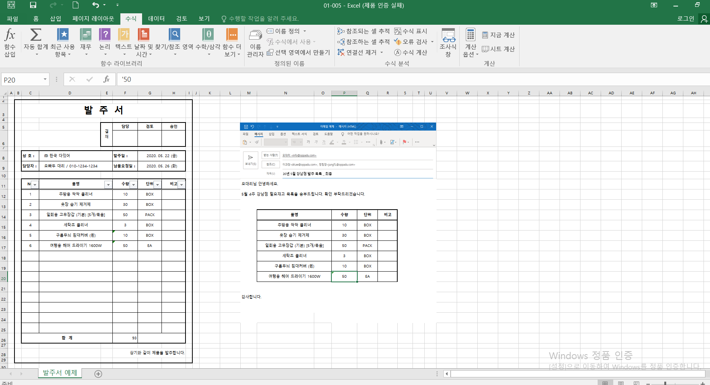
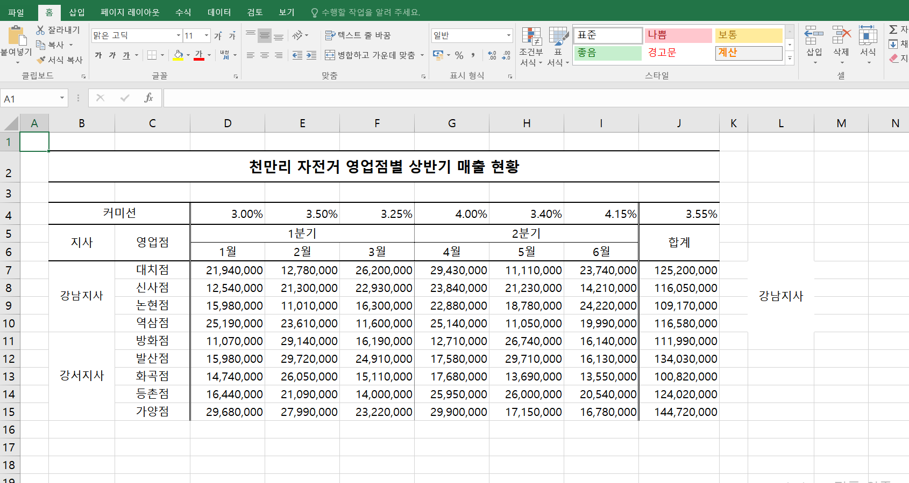
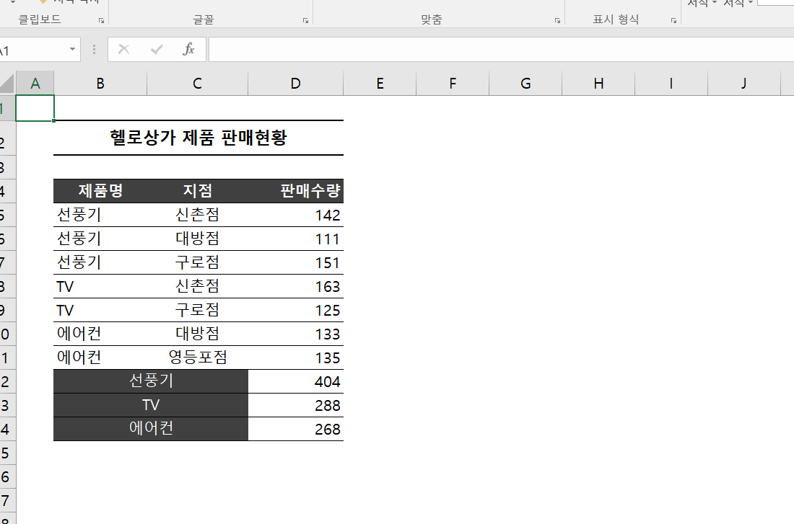

# Excel 1주차 정규 과제 

📌Excel 정규과제는 매주 정해진 분량의 『*진짜 쓰는 실무 엑셀*』 을 읽고 학습하는 것입니다. 이번주는 아래의 **EXCEL_1st_TIL**에 나열된 분량을 읽고 공부하시면 됩니다.

아래의 문제를 풀어보며 학습 내용을 점검하세요. 문제를 해결하는 과정에서 개념을 스스로 정리하고, 필요한 경우 제시된 강의를 참고하여 보완하는 것이 좋습니다.

**교재 실습 예제 파일은 1주차 과제 설명 노션에 있습니다. 해당 파일을 다운 후 실습 진행해주시면 됩니다.** 

**👀(수행 인증샷은 필수입니다.)** 

## EXCEL_1st_TIL

### 1장 시작부터 남다른 실무자의 엑셀 활용
#### 01. 엑셀 기본 설정 변경으로 맞춤 환경 만들기 (범위 제외)
#### 02. 엑셀 좀 사용하려면 반드시 알아야 할 엑셀 기본키 (범위 제외)
#### 03. 엑셀의 기본 동작 원리 이해하기
#### 04. 엑셀에서 발생하는 모든 오류와 해결 방법 총정리
#### 05. 실무자면 꼭 알아야 할, 필수 단축키 모음

### 2장 실무자라면 반드시 알아야 할 엑셀 활용
#### 01. 보기 좋은 표, 활용할 수 있는 데이터를 위한 필수 상식
#### 02. 편리한 엑셀 문서 작업을 위한 실력 다지기
#### 03. 엑셀로 시작하는 기초 데이터 분석
#### 02. 엑셀 데이터 가공을 위한 텍스트 나누고 합치기

## Study Schedule

| 주차  | 공부 범위     | 완료 여부 |
| ----- | ------------- | --------- |
| 1주차 | p.22~111    | ✅         |
| 2주차 | p.112~157   | 🍽️         |
| 3주차 | p.158~213  | 🍽️         |
| 4주차 | p.214~273 | 🍽️         |
| 5주차 | p.274~339 | 🍽️         |
| 6주차 | p.340~425 | 🍽️         |
| 7주차 | p.426~472 | 🍽️         |

 

<!-- 여기까진 그대로 둬 주세요-->

---

# 1️⃣ 학습 내용 정리

## 01-3. 엑셀의 기본 동작 원리 이해하기
> **셀 참조 방식에 대해 정리해주세요.**
<!-- 셀 참조 방식에 대해 정리해주세요. -->

# 📗 엑셀 기초 정리

## 1. 셀 참조 방식 이해하기

엑셀에서는 수식을 복사하거나 자동 채우기할 때 **셀 참조 방식에 따라 참조되는 셀 주소가 달라짐.**

셀 참조 방식은 다음과 같이 구분함.

| 참조 방식 | 예시 | 의미 |
|---|---|---|
| 상대 참조 | `A3` | 행과 열 모두 변경 |
| 절대 참조 | `$A$3` | 행과 열 모두 고정 |
| 혼합 참조 | `$A3` | 열 고정, 행 변경 |
| 혼합 참조 | `A$3` | 행 고정, 열 변경 |

### 💲 `$` 기호의 의미

`$` 기호는 **행 또는 열을 고정할 때 사용함.**

- `$A3` → A열 고정
- `A$3` → 3행 고정
- `$A$3` → A열과 3행 모두 고정
- `A3` → 행과 열 모두 변경 가능

---

## 2. 🔄 상대 참조

상대 참조는 셀 주소에 `$` 기호가 없는 기본 참조 방식임.

예시:

`=C6+D6`

이 수식을 아래로 자동 채우기하면 다음과 같이 변경됨.

- `=C6+D6`
- `=C7+D7`
- `=C8+D8`
- `=C9+D9`

즉, 수식을 복사하거나 자동 채우기하면 **위치에 따라 참조하는 셀 주소도 함께 변경됨.**

---

## 3. 🔒 절대 참조

절대 참조는 **행과 열을 모두 고정하는 방식**임.

예시:

`=$F$5*E6`

이 수식을 아래로 자동 채우기하면:

- `=$F$5*E6`
- `=$F$5*E7`
- `=$F$5*E8`
- `=$F$5*E9`

처럼 변경됨.

이때:

- `$F$5` → 고정됨
- `E6` → 위치에 따라 변경됨

### 📌 절대 참조 활용

동일한 값을 여러 계산에서 반복적으로 사용할 때 유용함.

예를 들어:

- 커미션 비율
- 세율
- 환율
- 할인율

등을 한 셀에 입력해두고 계속 참조할 때 사용할 수 있음.

---

## 4. 🔀 혼합 참조

혼합 참조는 **행과 열 중 한쪽만 고정하는 방식**임.

### ① 열 고정

`=$A3`

- A열 → 고정
- 행 번호 → 변경

### ② 행 고정

`=A$3`

- 열 → 변경
- 3행 → 고정

### 📌 혼합 참조 예시

`=C$4*$B5`

이 경우:

- `C$4` → 4행 고정
- `$B5` → B열 고정

가로 방향과 세로 방향으로 동시에 자동 채우기를 사용할 때 유용함.

---

## 5. ⌨️ F4 키를 이용한 참조 방식 변경

셀 주소를 선택한 상태에서 `F4` 키를 반복해서 누르면 참조 방식이 변경됨.

`A3`  
↓  
`$A$3`  
↓  
`A$3`  
↓  
`$A3`  
↓  
`A3`

즉, `$` 기호를 직접 입력하지 않아도 F4 키를 이용해 빠르게 참조 방식을 변경할 수 있음.

---

# 🧮 엑셀에서 사용하는 4가지 연산자

엑셀에서 사용하는 연산자는 크게 다음 4가지로 구분함.

1. ➕ 산술 연산자
2. ⚖️ 비교 연산자
3. 🔤 텍스트 연산자
4. 📍 참조 연산자

---

## 6. ➕ 산술 연산자

숫자를 계산할 때 사용하는 연산자임.

| 연산자 | 의미 | 사용 예시 | 결과 |
|---|---|---|---|
| `+` | 더하기 | `=1+2` | 3 |
| `-` | 빼기 또는 음수 | `=1-2` | -1 |
| `*` | 곱하기 | `=1*2` | 2 |
| `/` | 나누기 | `=1/2` | 0.5 |
| `%` | 백분율 | `=1%` | 0.01 |
| `^` | 거듭제곱 | `=2^2` | 4 |

### 📌 주요 특징

- 곱하기는 `×`가 아니라 `*`를 사용함.
- 나누기는 `÷`가 아니라 `/`를 사용함.
- 거듭제곱은 `^`를 사용함.
- `%`는 백분율을 나타냄.

---

## 7. ⚖️ 비교 연산자

두 값을 비교하여 결과를 `TRUE` 또는 `FALSE`로 반환함.

| 연산자 | 의미 | 사용 예시 | 결과 |
|---|---|---|---|
| `=` | 같음 | `=1=2` | FALSE |
| `>` | 보다 큼 | `=1>2` | FALSE |
| `<` | 보다 작음 | `=1<2` | TRUE |
| `>=` | 크거나 같음 | `=1>=2` | FALSE |
| `<=` | 작거나 같음 | `=1<=2` | TRUE |
| `<>` | 같지 않음 | `=1<>2` | TRUE |

### 📌 활용

비교 연산자는 이후 다음과 같은 함수에서 조건을 설정할 때 많이 사용함.

- `IF`
- `COUNTIF`
- `SUMIF`
- `AVERAGEIF`

---

## 8. 🔤 텍스트 연산자

### `&` : 텍스트 연결

여러 텍스트를 하나로 연결할 때 사용함.

예시:

`="DArt-"&"B"`

결과:

`DArt-B`

즉, `&` 기호를 이용하면 여러 문자나 셀 값을 하나의 텍스트로 합칠 수 있음.

---

## 9. 📍 참조 연산자

셀 또는 셀 범위를 지정할 때 사용하는 연산자임.

### ① `:` 범위 연산자

`A1:C1`

→ A1부터 C1까지의 모든 셀을 하나의 범위로 지정함.

예시:

`=SUM(A1:C1)`

→ A1, B1, C1의 값을 모두 더함.

---

### ② `,` 여러 셀 또는 범위 결합

`A1:A2,C1:C2`

→ 서로 떨어져 있는 여러 범위를 함께 지정함.

즉:

- A1:A2 범위
- C1:C2 범위

를 동시에 참조함.

---

### ③ 공백 : 교차되는 범위

두 범위가 서로 겹치는 부분을 의미함.

예시:

`B1:B5 A3:C3`

두 범위의 공통 부분은:

`B3`

따라서 결과적으로 B3 셀을 참조함.

---

# 📌 셀 참조 방식 한눈에 정리

| 수식 | 열 | 행 | 참조 방식 |
|---|---|---|---|
| `A3` | 변경 | 변경 | 상대 참조 |
| `$A$3` | 고정 | 고정 | 절대 참조 |
| `$A3` | 고정 | 변경 | 혼합 참조 |
| `A$3` | 변경 | 고정 | 혼합 참조 |

---

# ✅ 핵심 정리

### 🔄 상대 참조
- 행과 열 모두 변경됨.
- 예시: `A3`

### 🔒 절대 참조
- 행과 열 모두 고정됨.
- 예시: `$A$3`

### 🔀 혼합 참조
- 행 또는 열 중 한쪽만 고정됨.
- 예시: `$A3`, `A$3`

### 💲 `$` 기호
- 고정하고 싶은 행 또는 열 앞에 사용함.

### ⌨️ F4
- 셀 참조 방식을 빠르게 변경할 수 있음.

### ➕ 산술 연산자
- 숫자 계산에 사용함.

### ⚖️ 비교 연산자
- 두 값을 비교하여 TRUE/FALSE 결과를 반환함.

### 🔤 텍스트 연산자
- `&`를 사용하여 텍스트를 연결함.

### 📍 참조 연산자
- 셀 또는 범위를 지정하거나 결합할 때 사용함.

## 01-4. 엑셀에서 발생하는 모든 오류와 해결 방법 총정리
> **숫자처럼 보이는 문자를 빠르게 확인하고 해결하기(51 ~52p)를 진행 후 인증사진을 첨부해주세요.**

## 01-5. 실무자면 꼭 알아야 할, 필수 단축키 모음
> **이번에 배운 단축키에 대해 정리해주세요.**
<!-- 여기에 정리해주세요. -->
# ⌨️ 엑셀 단축키 정리

## 📁 파일 관련

| 기능 | Windows | Mac |
|---|---|---|
| 새 통합 문서 | `Ctrl + N` | `Command + N` |
| 파일 열기 | `Ctrl + O` | `Command + O` |
| 저장 | `Ctrl + S` | `Command + S` |
| 다른 이름으로 저장 | `F12` | `Command + Shift + S` |
| 인쇄 | `Ctrl + P` | `Command + P` |
| 엑셀 종료 | `Alt + F4` | `Command + Q` |

---

## ✏️ 편집 관련

| 기능 | Windows | Mac |
|---|---|---|
| 복사 | `Ctrl + C` | `Command + C` |
| 붙여넣기 | `Ctrl + V` | `Command + V` |
| 잘라내기 | `Ctrl + X` | `Command + X` |
| 실행 취소 | `Ctrl + Z` | `Command + Z` |
| 다시 실행 | `Ctrl + Y` | `Command + Y` |
| 모두 선택 | `Ctrl + A` | `Command + A` |
| 찾기 | `Ctrl + F` | `Command + F` |
| 바꾸기 | `Ctrl + H` | `Control + H` 또는 메뉴 사용 |

---

## 🧮 셀 입력 및 수정

| 기능 | Windows | Mac |
|---|---|---|
| 셀 내용 수정 | `F2` | `Control + U` 또는 셀 더블클릭 |
| 입력 확정 | `Enter` | `Enter` |
| 입력 취소 | `Esc` | `Esc` |
| 같은 셀에서 줄바꿈 | `Alt + Enter` | `Control + Option + Return` |
| 현재 날짜 입력 | `Ctrl + ;` | `Control + ;` |
| 현재 시간 입력 | `Ctrl + Shift + ;` | `Command + ;` 계열은 버전에 따라 다를 수 있음 |
| 위 셀 내용 복사 | `Ctrl + D` | `Command + D` |
| 왼쪽 셀 내용 복사 | `Ctrl + R` | `Command + R` |

---

## 🔢 수식 관련

| 기능 | Windows | Mac |
|---|---|---|
| 수식 입력 시작 | `=` | `=` |
| 자동 합계 | `Alt + =` | `Command + Shift + T` |
| 수식 표시/숨기기 | `Ctrl + `` ` | `Control + `` ` |
| 참조 방식 변경 | `F4` | `Command + T` 또는 `Fn + F4` |
| 절대 참조 | `$A$1` | `$A$1` |
| 열 고정 혼합 참조 | `$A1` | `$A1` |
| 행 고정 혼합 참조 | `A$1` | `A$1` |

---

## 📌 셀 선택 관련

| 기능 | Windows | Mac |
|---|---|---|
| 한 칸 이동 | `방향키` | `방향키` |
| 데이터 끝까지 이동 | `Ctrl + 방향키` | `Command + 방향키` |
| 범위 선택 | `Shift + 방향키` | `Shift + 방향키` |
| 데이터 끝까지 범위 선택 | `Ctrl + Shift + 방향키` | `Command + Shift + 방향키` |
| 전체 행 선택 | `Shift + Space` | `Shift + Space` |
| 전체 열 선택 | `Ctrl + Space` | `Control + Space` |
| 전체 시트 선택 | `Ctrl + A` | `Command + A` |

---

## ➕ 행·열·셀 관련

| 기능 | Windows | Mac |
|---|---|---|
| 셀/행/열 삽입 | `Ctrl + +` | `Command + +` |
| 셀/행/열 삭제 | `Ctrl + -` | `Command + -` |
| 행 숨기기 | `Ctrl + 9` | `Control + 9` |
| 열 숨기기 | `Ctrl + 0` | `Control + 0` |

---

## 🎨 서식 관련

| 기능 | Windows | Mac |
|---|---|---|
| 굵게 | `Ctrl + B` | `Command + B` |
| 기울임 | `Ctrl + I` | `Command + I` |
| 밑줄 | `Ctrl + U` | `Command + U` |
| 셀 서식 창 | `Ctrl + 1` | `Command + 1` |
| 취소선 | `Ctrl + 5` | `Command + Shift + X` 또는 메뉴 사용 |

---

## 📊 데이터 관련

| 기능 | Windows | Mac |
|---|---|---|
| 필터 설정/해제 | `Ctrl + Shift + L` | `Command + Shift + F` 또는 메뉴 사용 |
| 표 만들기 | `Ctrl + T` | `Command + T` |
| 빠른 채우기 | `Ctrl + E` | 버전에 따라 메뉴 사용 |
| 데이터 새로고침 | `Ctrl + Alt + F5` | `Command + Option + F5` 계열 |

---

## 📑 시트 관련

| 기능 | Windows | Mac |
|---|---|---|
| 다음 시트 이동 | `Ctrl + Page Down` | `Option + →` 또는 `Fn + Control + ↓` |
| 이전 시트 이동 | `Ctrl + Page Up` | `Option + ←` 또는 `Fn + Control + ↑` |
| 새 시트 추가 | `Shift + F11` | `Shift + F11` |

---

## 02-1. 보기 좋은 표, 활용할 수 있는 데이터를 위한 필수 상식
> **데이터와 표를 비교해주세요**
<!-- 여기에 정리해주세요. -->

> **셀 병합 기능을 자제해야 하는 이유를 정리해주세요.**
<!-- 여기에 정리해주세요. -->
 

