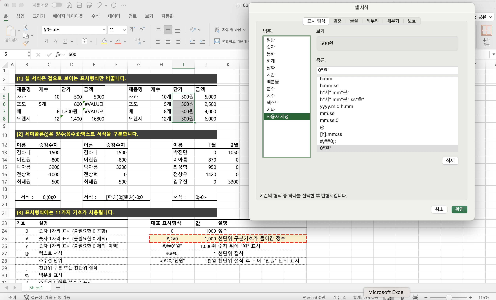
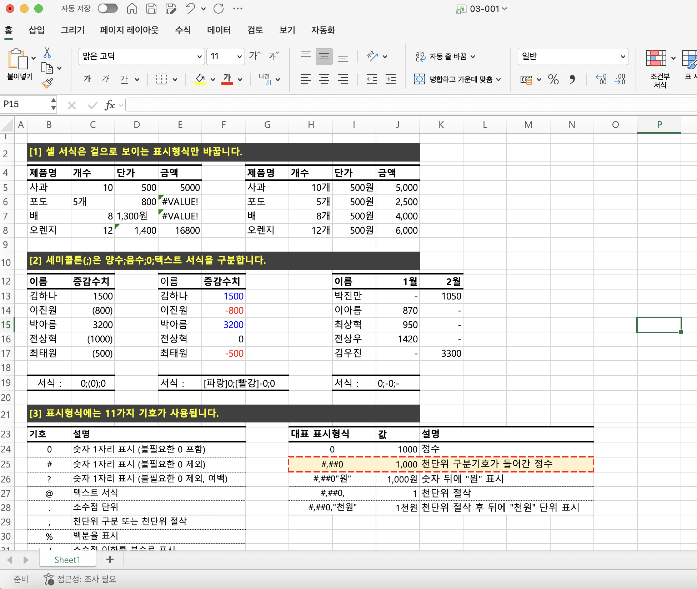
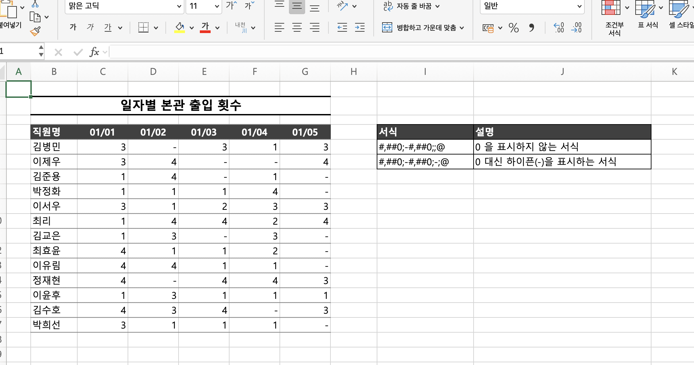
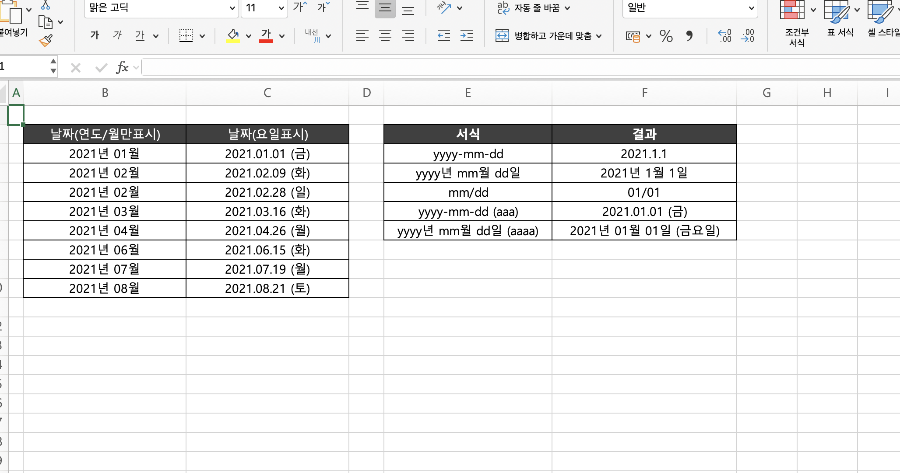
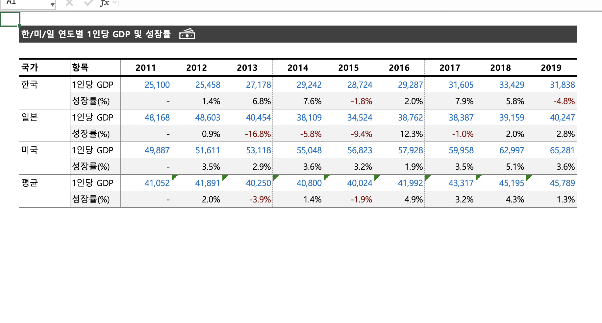
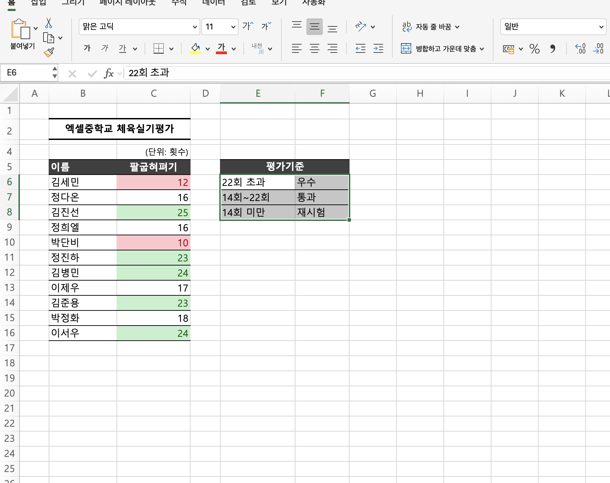
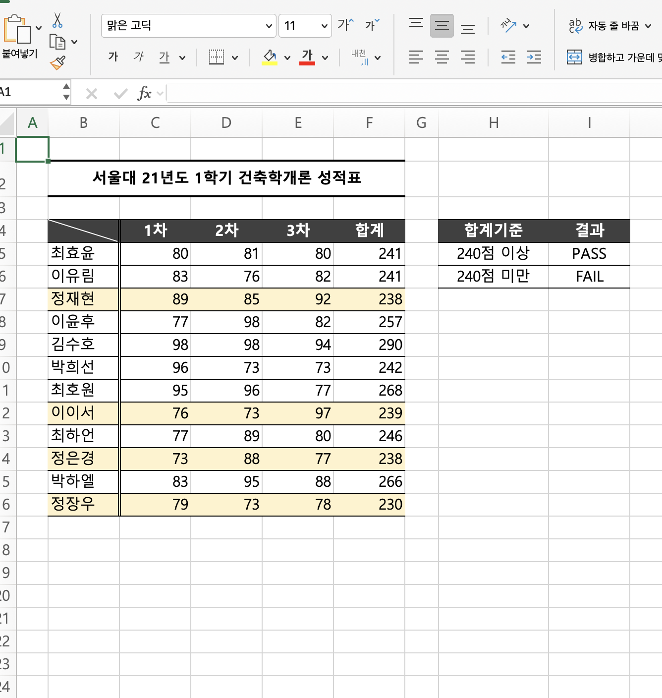
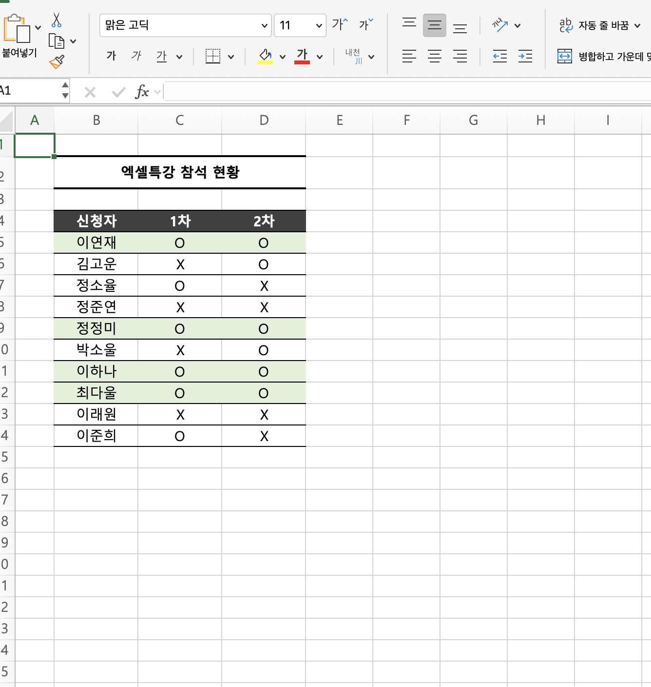

# Excel 2주차 정규 과제 

📌Excel 정규과제는 매주 정해진 분량의 『*진짜 쓰는 실무 엑셀*』 을 읽고 학습하는 것입니다. 이번주는 아래의 **EXCEL_2nd_TIL**에 나열된 분량을 읽고 공부하시면 됩니다.

아래의 문제를 풀어보며 학습 내용을 점검하세요. 문제를 해결하는 과정에서 개념을 스스로 정리하고, 필요한 경우 제시된 강의를 참고하여 보완하는 것이 좋습니다.

**교재 실습 예제 파일은 1주차 과제 설명 노션에 있습니다. 해당 파일을 다운 후 실습 진행해주시면 됩니다.**

**👀(수행 인증샷은 필수입니다.)** 

## EXCEL_2nd_TIL

### 3장 보고서가 달라지는 서식 활용법
#### 01. 반드시 숙지해야 할 셀 서식 기초
#### 02. 실무자를 위한 셀 표시 형식 대표 예제
#### 03. 깔끔한 보고서 작성을 위한 기본 규칙
#### 04. 조건부 서식으로 빠르게 데이터 분석하기
#### 05. 데이터 이해를 돕는 시각화 요소 추가하기 (범위 제외)

## Study Schedule

| 주차  | 공부 범위     | 완료 여부 |
| ----- | ------------- | --------- |
| 1주차 | p.22~111    | ✅         |
| 2주차 | p.112~157   | ✅         |
| 3주차 | p.158~213  | 🍽️         |
| 4주차 | p.214~273 | 🍽️         |
| 5주차 | p.274~339 | 🍽️         |
| 6주차 | p.340~425 | 🍽️         |
| 7주차 | p.426~472 | 🍽️         |

 

<!-- 여기까진 그대로 둬 주세요-->

---

# 1️⃣ 학습 내용 정리

# 📌 엑셀 사용자 지정 셀 서식 정리

## 🔣 주요 표시 형식 기호

| 기호 | 의미 |
|---|---|
| `0` | 숫자 1자리 표시, 불필요한 0도 표시함 |
| `#` | 숫자 1자리 표시, 불필요한 0은 표시하지 않음 |
| `?` | 숫자 1자리 표시, 불필요한 0 대신 여백을 표시함 |
| `@` | 텍스트를 표시함 |
| `.` | 소수점 위치를 지정함 |
| `,` | 천 단위 구분 기호를 표시하거나 천 단위로 절사함 |
| `%` | 백분율로 표시함 |
| `/` | 소수점 이하 값을 분수로 표시함 |
| `*` | `*` 뒤의 문자를 셀 너비 끝까지 반복함 |
| `_` | `_` 뒤 문자 크기만큼 여백을 표시함 |
| `[ ]` | 특정 조건 또는 색상을 적용함 |

---

## 🔢 숫자 표시 형식

| 표시 형식 | 값이 `1000`일 때 | 의미 |
|---|---:|---|
| `G/표준` | 1000 | 일반적인 기본 서식 |
| `0` | 1000 | 정수로 표시함 |
| `#,##0` | 1,000 | 천 단위 구분 기호를 표시함 |
| `#,##0"원"` | 1,000원 | 숫자 뒤에 `원`을 표시함 |
| `$#,##0.00` | $1,000.00 | `$` 기호와 소수점 둘째 자리까지 표시함 |
| `#,##0,` | 1 | 천 단위로 절사함 |
| `#,##0,"천원"` | 1천원 | 천 단위로 절사한 뒤 `천원`을 표시함 |

> 💡 실무에서 자주 사용하는 숫자 표시 형식은 `#,##0`이며, 천 단위마다 쉼표를 표시할 수 있음.
---
## 📅 날짜 표시 형식

| 기호 | 형식 | 표시 예시 | 의미 |
|---|---|---|---|
| `Y` | `YYYY` | 2026 | 연도를 4자리로 표시함 |
| `Y` | `YY` | 26 | 연도를 2자리로 표시함 |
| `M` | `MM` | 01, 02 | 월을 두 자리 숫자로 표시함 |
| `M` | `M` | 1, 2 | 월을 한두 자리 숫자로 표시함 |
| `M` | `MMM` | Jan, Feb | 월을 짧은 영문으로 표시함 |
| `M` | `MMMM` | January, February | 월을 전체 영문으로 표시함 |
| `D` | `DD` | 01, 02 | 일을 두 자리 숫자로 표시함 |
| `D` | `D` | 1, 2 | 일을 한두 자리 숫자로 표시함 |
| `D` | `DDD` | Mon, Tue | 요일을 짧은 영문으로 표시함 |
| `D` | `DDDD` | Monday, Tuesday | 요일을 전체 영문으로 표시함 |
| `A` | `AAA` | 월, 화 | 요일을 짧은 한글로 표시함 |
| `A` | `AAAA` | 월요일, 화요일 | 요일을 전체 한글로 표시함 |

---

## 💡 자주 사용하는 날짜 표시 형식

| 원하는 표시 | 사용자 지정 서식 |
|---|---|
| `2026-09-14` | `yyyy-mm-dd` |
| `2026년 9월 14일` | `yyyy"년" m"월" d"일"` |
| `9월 14일` | `m"월" d"일"` |
| `2026.09.14 (월)` | `yyyy.mm.dd (aaa)` |

## 03-1. 반드시 숙지해야 할 셀 서식 기초
> **표시 형식은 걸으로 보이는 형식만 바꾼다(113 ~ 115p)를 진행 후 인증사진을 첨부해주세요.**

> **세미콜론으로 양수, 음수, 0, 텍스트 서식을 구분한다(115 ~ 117p)를 진행 후 인증사진을 첨부해주세요.**

## 03-2. 실무자를 위한 셀 표시 형식 대표 예제
> **0 지우거나 하이픈[-]으로 표시하기(119 ~121p)를 진행 후 인증사진을 첨부해주세요.**

> **날짜를 년/월/일 [요일]로 표시하기(121 ~122p)를 진행 후 인증사진을 첨부해주세요.**

## 03-3. 깔끔한 보고서 작성을 위한 기본 규칙
> **깔끔한 보고서 완성하기(131 ~134p)를 진행 후 인증사진을 첨부해주세요.**

## 03-4. 조건부 서식으로 빠르게 데이터 분석하기
> **특정 값보다 크거나 작을 때 강조하기(137 ~139p)를 진행 후 인증사진을 첨부해주세요.**

> **조건을 만족할 때 전체 행 강조하기(141 ~142p)를 진행 후 인증사진을 첨부해주세요.**

> **여러 조건에 모두 만족하는 셀 강조하기(143 ~144p)를 진행 후 인증사진을 첨부해주세요.**

---

### 🎉 수고하셨습니다.

