# Excel 3주차 정규 과제 

📌Excel 정규과제는 매주 정해진 분량의 『*진짜 쓰는 실무 엑셀*』 을 읽고 학습하는 것입니다. 이번주는 아래의 **EXCEL_3rd_TIL**에 나열된 분량을 읽고 공부하시면 됩니다.

아래의 문제를 풀어보며 학습 내용을 점검하세요. 문제를 해결하는 과정에서 개념을 스스로 정리하고, 필요한 경우 제시된 강의를 참고하여 보완하는 것이 좋습니다.

**교재 실습 예제 파일은 1주차 과제 설명 노션에 있습니다. 해당 파일을 다운 후 실습 진행해주시면 됩니다.**

**👀(수행 인증샷은 필수입니다.)** 

## EXCEL_3rd_TIL

### 4장 완성한 엑셀 보고서 공유 및 출력하기
#### 01. 1분 투자로 100점짜리 보고서 완성하기
#### 02. 외부 통합 문서 참조할 때 발생하는 오류 처리하기
#### 03. 외부 공유를 대비하여 정보를 관리하자 (범위 제외)
#### 04. 엑셀 파일 크기를 절반으로 줄이는 방법 3가지 (범위 제외)
#### 05. 엑셀은 보안 측면에서 완벽한 프로그램이 아니다
#### 06. 실무자가 반드시 알아야 할 인쇄 설정 기본
#### 07. 여러 페이지 보고서를 인쇄할 때 확인 사항
#### 08. 엑셀 문서를 PDF로 변환하는 가장 쉬운 방법 (범위 제외)

## Study Schedule

| 주차  | 공부 범위     | 완료 여부 |
| ----- | ------------- | --------- |
| 1주차 | p.22~111    | ✅         |
| 2주차 | p.112~157   | ✅         |
| 3주차 | p.158~213  | ✅         |
| 4주차 | p.214~273 | 🍽️         |
| 5주차 | p.274~339 | 🍽️         |
| 6주차 | p.340~425 | 🍽️         |
| 7주차 | p.426~472 | 🍽️         |

 

<!-- 여기까진 그대로 둬 주세요-->

---

# 1️⃣ 학습 내용 정리

## 04-1. 1분 투자로 100점짜리 보고서 완성하기
> **입력하는 값 & 계산되는 값 구분하기(162 ~ 163p)를 진행 후 인증사진을 첨부해주세요.**
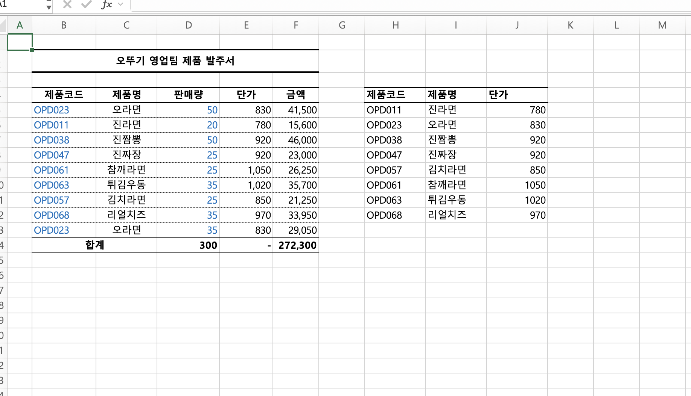

## 04-2. 외부 통합 문서 참조할 때 발생하는 오류 처리하기
> **외부 데이터 원본에 대한 연결 오류 해결하기(166 ~167p)를 진행 후 인증사진을 첨부해주세요.**
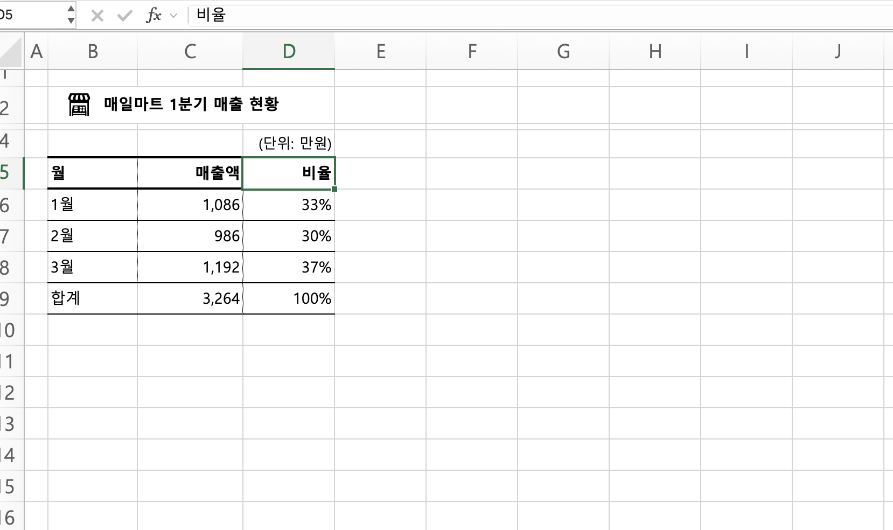

## ( 04-4. 엑셀파일 크기를 절반으로 줄이는 방법 )
### 1. 바이너리 형태로 저장하기
엑셀 파일을 일반 형식인 `.xlsx`가 아니라 **Excel 바이너리 통합 문서(.xlsb)** 형식으로 저장하는 방법.
- 일반 엑셀 파일보다 **파일 크기를 줄일 수 있음**
- 보통 약 **10~35% 정도 용량 감소** 가능
- 대용량 데이터가 포함된 경우 **파일을 열고 저장하는 속도가 빨라질 수 있음**
- 서식, 함수, 피벗 테이블, VBA 매크로 등의 기능을 대부분 유지할 수 있음
#### 단점
- 일반 `.xlsx` 파일보다 **다른 프로그램과의 호환성이 떨어질 수 있음**
- 일부 파일 관리 기능에 제한이 있을 수 있음
---
### 2. 함수를 모두 값으로 변경
엑셀에 함수가 많이 들어가 있으면 함수식과 계산 정보를 계속 저장하고 계산해야 하므로 파일 크기가 커질 수 있음.
따라서 더 이상 계산할 필요가 없는 함수는 **결과값만 남기고 값으로 변환**하면 파일 크기를 줄일 수 있음.
#### 방법
1. 함수가 입력된 셀 범위를 선택
2. `Ctrl + C` 또는 `Command + C`로 복사
3. **선택하여 붙여넣기**
4. **값(Value)** 선택
---
### 3. 피벗 캐시 지우기
엑셀에서 피벗 테이블을 만들면 원본 데이터를 빠르게 분석하기 위해 **피벗 캐시(Pivot Cache)**라는 별도의 데이터를 저장.
#### 장점
- 피벗 테이블이 많은 파일에서 파일 용량 감소 효과가 큼
- 원본 데이터의 행이 많을수록 효과적
- 불필요하게 저장된 중복 데이터를 줄일 수 있음
---

## 04-5. 엑셀은 보안 측면에서 완벽한 프로그램이 아니다
> **데이터 유효성 검사로 입력할 데이터 제한하기(179 ~183p)를 진행 후 인증사진을 첨부해주세요.**
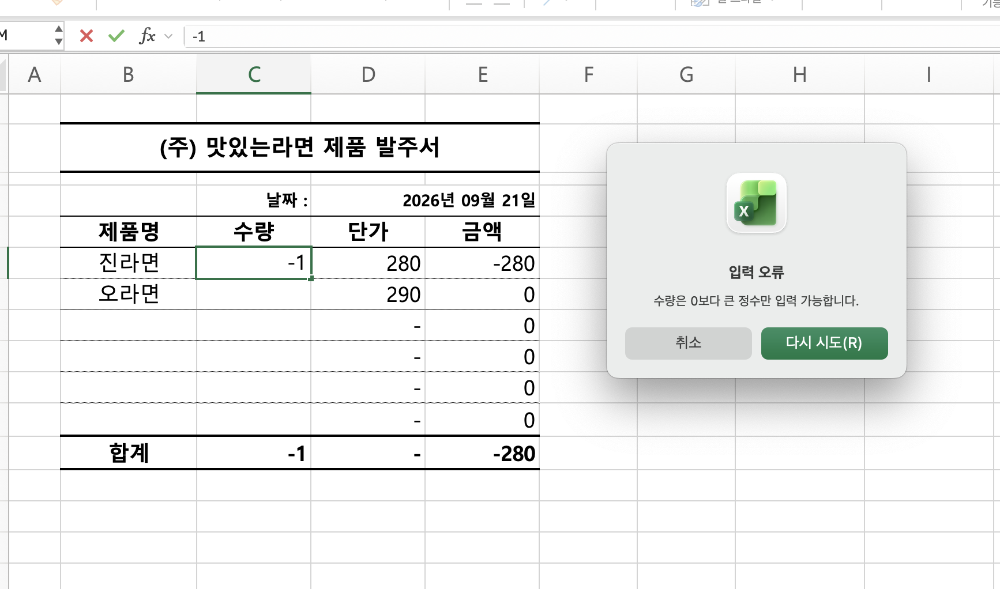
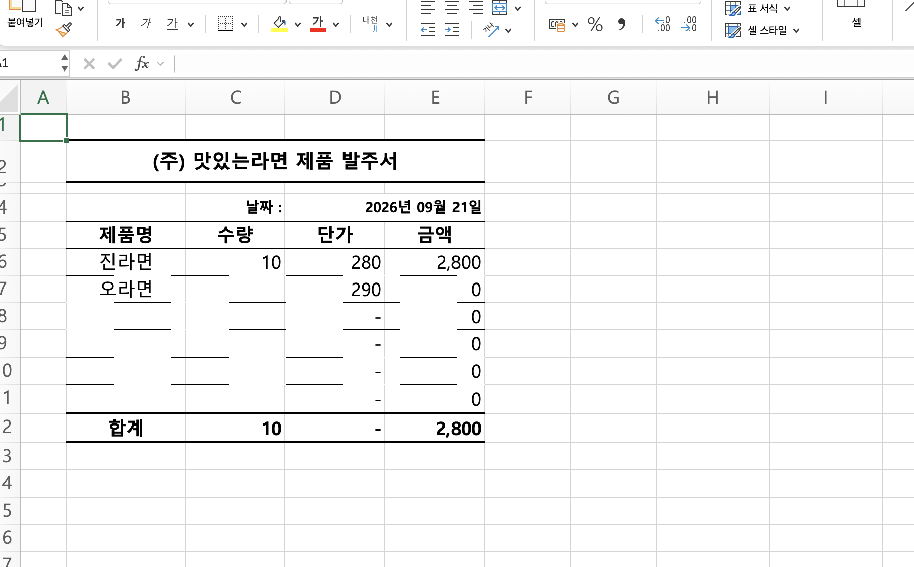

> **시트 내용을 수정하지 못하도록 보호하기(186 ~190p)를 진행 후 인증사진을 첨부해주세요.**
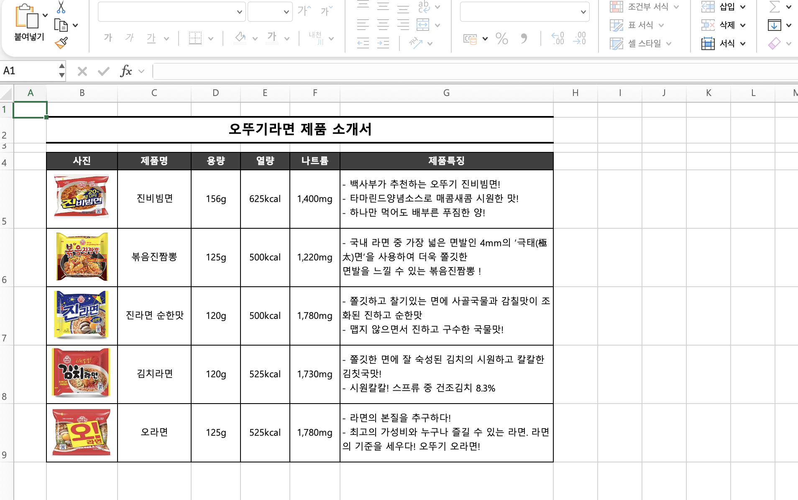
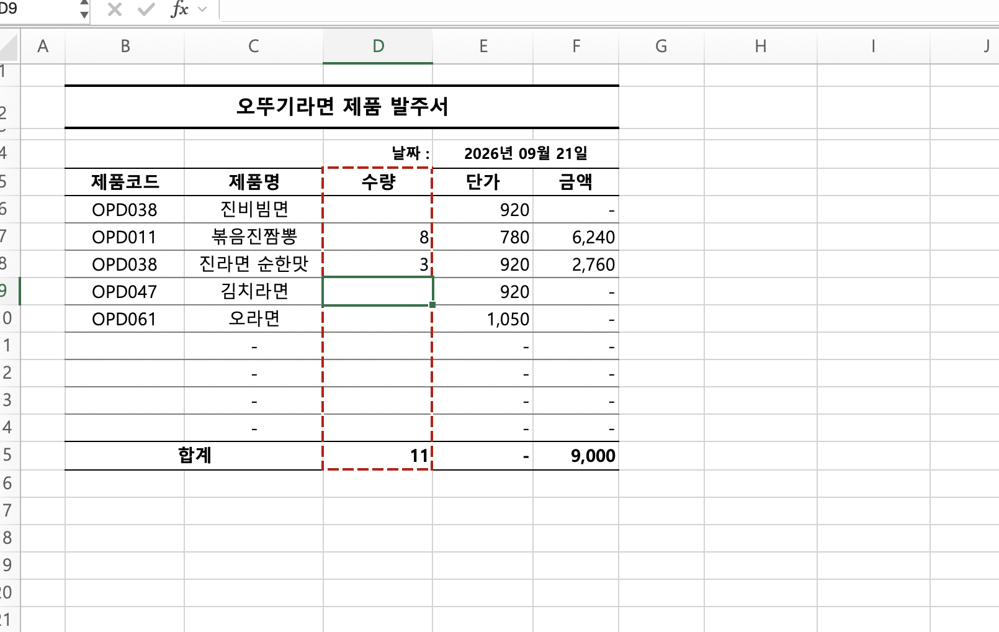
## 허용할 기능 목록 정리
- **잠긴 셀 선택**
  - 잠긴 셀 선택 가능함

- **잠기지 않은 셀 선택**
  - 해당 기능까지 해제하면 시트를 눈으로만 볼 수 있음

- **셀 서식, 열 서식, 행 서식**
  - 셀 또는 행/열 전체의 서식 변경 가능함

- **열 삽입, 행 삽입**
  - 행 또는 열 삽입 가능함

- **하이퍼링크 삽입**
  - 잠금 해제된 셀 편집 시 하이퍼링크 삽입 가능함

- **열 삭제, 행 삭제**
  - 행 또는 열 삭제 가능함

- **정렬, 자동 필터 사용**
  - 데이터 정렬 및 자동 필터 기능 사용 가능함
  - 실무에서 시트 보호 시 자주 허용하는 옵션임

- **피벗 테이블 및 피벗 차트 사용**
  - 기존 피벗 테이블 및 피벗 차트 사용 가능함
  - 새로운 피벗 테이블이나 차트 추가는 불가능함

- **개체 편집**
  - 시트에 삽입된 도형, 슬라이서 등의 개체 사용 가능함
  - 엑셀 대시보드 작성 시 자주 활용함

- **시나리오 편집**
  - 목표값 찾기 기능의 시나리오 편집 가능함

## 04-6. 실무자가 반드시 알아야 할 인쇄 설정 기본
> **해당 내용(194 ~199p)를 진행 후 인증사진을 첨부해주세요.**
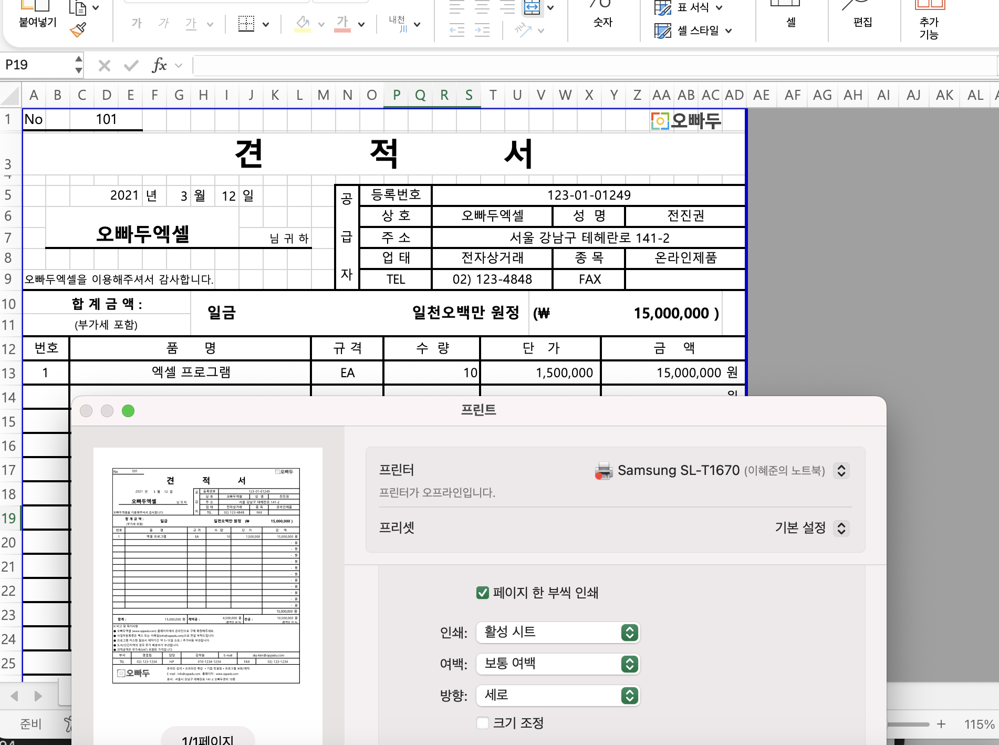
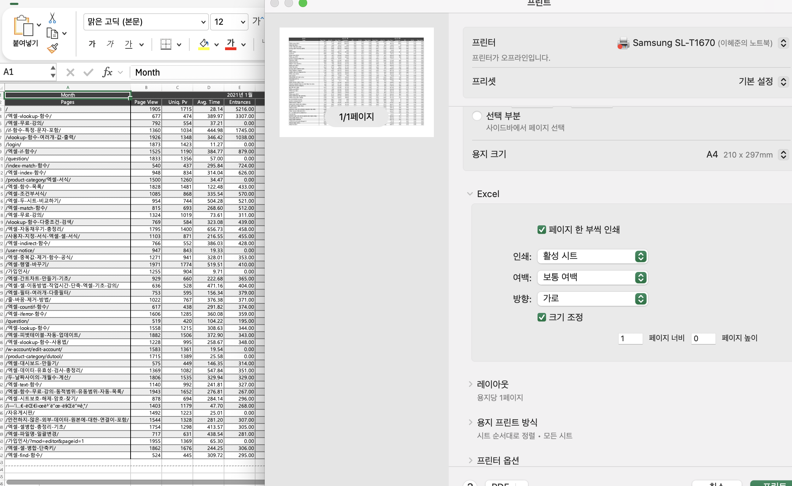
### 맥북은 방식이 조금 다른 것 같아요. ㅠ.ㅠ
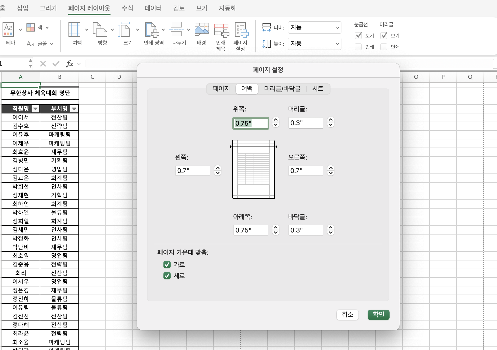
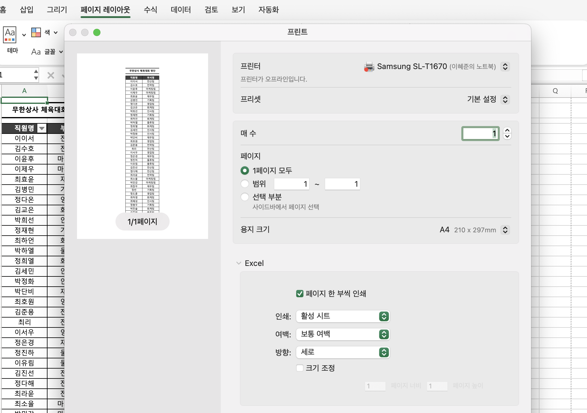

## 04-7. 여러 페이지 보고서를 인쇄할 때 확인 사항
> **해당 내용(200 ~207p)를 진행 후 인증사진을 첨부해주세요.**
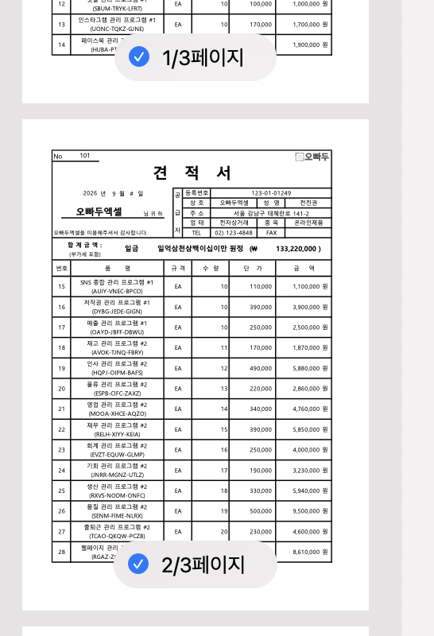
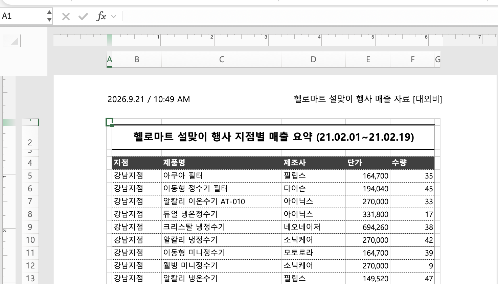
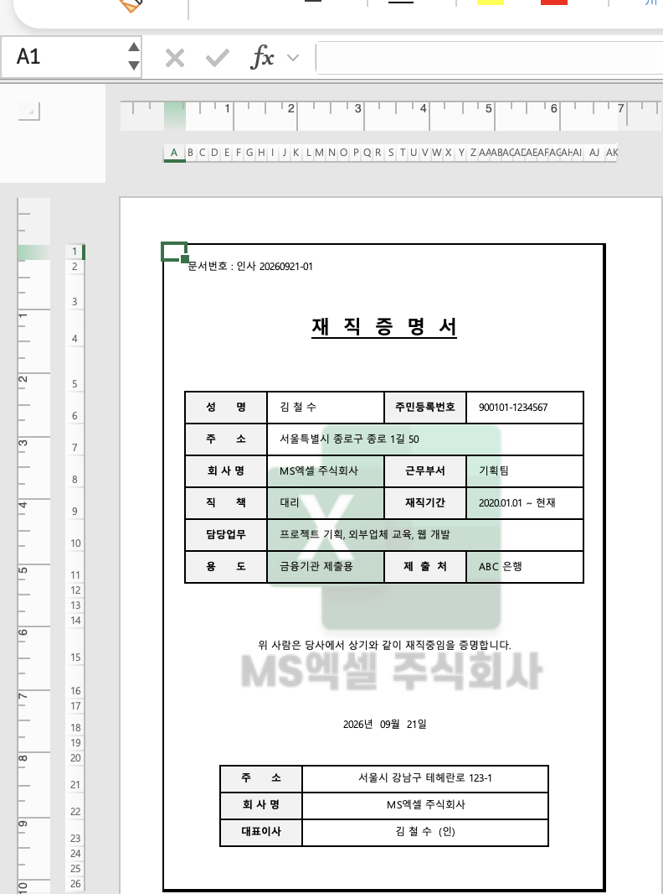
---

### 🎉 수고하셨습니다.

